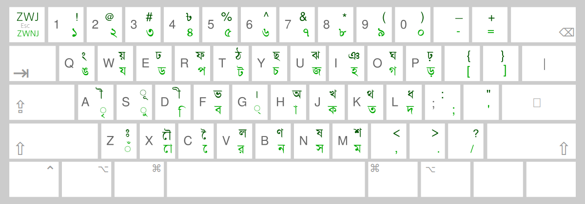
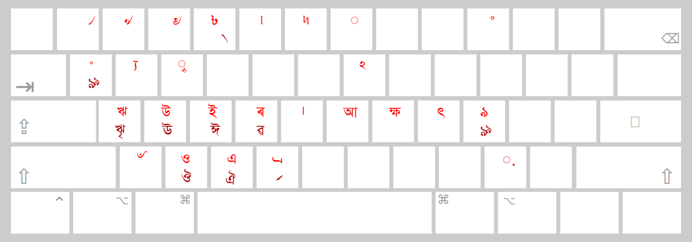

<div align="center">

# Jatiyo (জাতীয়) Keyboard Layout for Bengali

An open-source Bengali keyboard layout for Windows, macOS, Linux, Android, iOS, and Web according to the Bangladesh Standard Specification for Bangla Coded Character Set for Information Interchange ([BDS 1520:2018](https://bcc.gov.bd/pages/static-pages/688a355bf1fb5aa36c85a0b9)).


### [👉 Try the Live Web Demo Here! 👈](https://soaibsafi.github.io/jatiyo-keylayout/)
*(Type in Jatiyo instantly in your browser—no installation required!)*

</div>

---

## ⌨️ Layout

**Default layer (Unshifted & Shifted)**



**With Option/AltGr and Option/AltGr+Shift**




## 🚀 Installation

This project provides two ways to use the layout: natively on macOS (zero background apps), or cross-platform using the Keyman Engine.

### Platform 1: Windows, Linux, Android, iOS (Via Keyman)
This approach uses the compiled Keyman package (`.kmp`) located in the [keyman](./keyman/) directory.

1. Download and install the free [Keyman Engine](https://keyman.com/) for your operating system.
2. Go to the [Releases](https://github.com/soaibsafi/jatiyo-keylayout/releases) page of this repository.
3. Download the latest `jatiyo.kmp` file.
4. Double-click the downloaded file (or open it via the Keyman mobile app) to install the layout.

### Platform 2: macOS Native (Via Ukelele/PKG)
This approach installs a native Apple `.keylayout` file directly into your system without requiring any third-party background applications. Pick whichever method you're most comfortable with.

#### Option 1: Homebrew (recommended)
If you have [Homebrew](https://brew.sh/) installed:

```bash
brew tap soaib/jatiyo
brew install --cask jatiyo
```

#### Option 2: One-line shell installer

```bash
/bin/bash -c "$(curl -fsSL https://raw.githubusercontent.com/soaibsafi/jatiyo-keylayout/main/macos-native/install.sh)"
```

#### Option 3: Installer package (.pkg)

Download `Jatiyo-Installer.pkg` from the latest release, double-click it, and follow the on-screen steps.

> **Note**: Seeing "Apple could not verify … is free of malware"?
>
> The installer is not signed with an Apple Developer ID, so macOS Gatekeeper blocks it on first launch.
>
> 1. Open System Settings → Privacy & Security.
> 2. Scroll to the Security section and click "Open Anyway" next to the blocked installer warning.
> 3. Double-click the .pkg again.

#### Option 4: Manual installation

1. Download `jatiyo.keylayout` and `jatiyo.icns` from the `macos-native/` folder.
2. Copy both files into `/Library/Keyboard Layouts/` using Finder.
3. Log out of macOS and log back in to refresh the system cache.

#### Enabling the macOS layout

1. Open System Settings → Keyboard.
2. Under Input Sources, click Edit….
3. Click the + button at the bottom-left corner.
4. Choose Other (or Bengali), select বাংলা-জাতীয় and click Add.

## 🛠️ Building from source

### Compiling the Keyman Package

You will need Node.js and the Keyman compiler installed:

```bash
npm install -g @keymanapp/kmc
```

Then build the package:

```bash
cd keyman/source
kmc build jatiyo.kps
```

This produces the compiled `jatiyo.kmp` installer file and the `jatiyo.js` web target.

### Compiling the macOS Installer

The macOS installer package can be rebuilt locally using Apple's native `pkgbuild` tool:

```bash
cd macos-native
./build-installer.sh
```

This produces `dist/Jatiyo-Installer.pkg`.

**Optional environment variables:**

- `VERSION` — version string baked into the package (default: `1.0`)
- `IDENTIFIER` — package identifier (default: `me.soaib.Jatiyo`)


## Credits
- **Jatiyo keyboard layout** — inspired by the [Ekushey](https://ekushey.org/) project with minor bug fixes. 

- **macOS installer** — thanks to [@milon](https://github.com/milon) for the build and packaging scripts.

- **License** - This project is licensed under the MIT License. See [LICENSE](./LICENSE.md) for details. The layout is from the [Ekushey project](https://ekushey.org/). Please refer to their repository for the original license and credits related to the layout design. The keyman compiler and related tools are licensed by SIL Global. Please refer to the [Keyman repository](https://github.com/keymanapp/keyman) for more information.


## Contact & Feedback

- If you encounter any issues, have suggestions for improvements, or want to contribute, please open an issue or submit a pull request on the [GitHub repository](https://github.com/soaibsafi/jatiyo-keylayout).

- Maintainer: [Soaibuzzaman](https://soaib.me) ([@soaibsafi](https://github.com/soaibsafi))